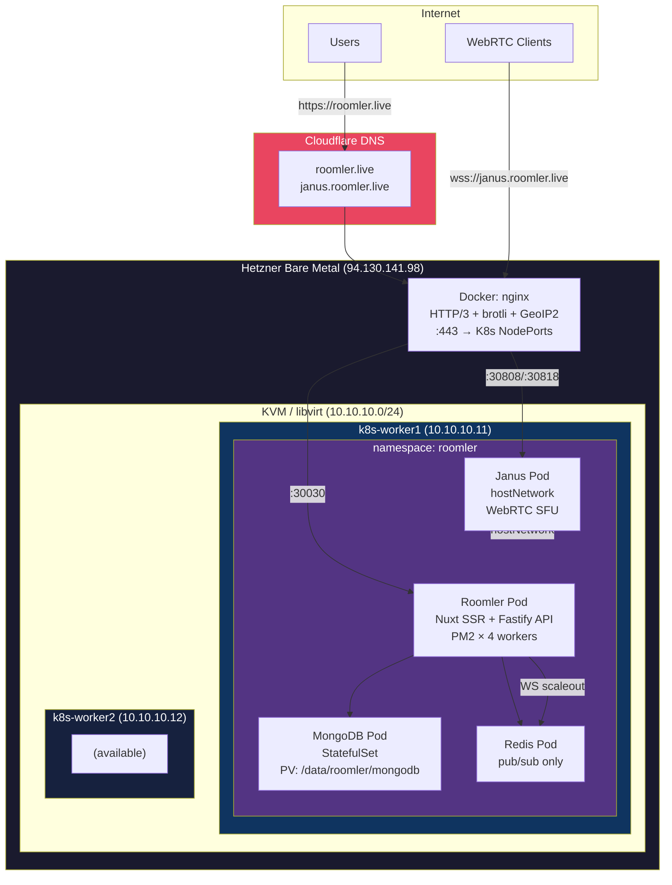
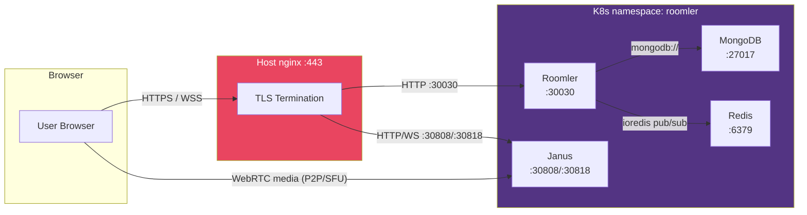
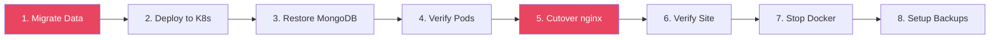
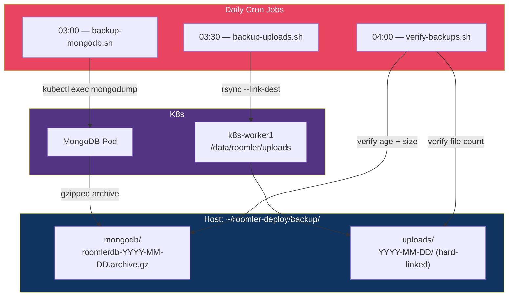

# Roomler K8s Deployment

Ansible-automated deployment of the [Roomler](https://github.com/nickvdyck/roomler) collaboration platform to Kubernetes. Migrates the full Docker stack (app, database, cache, WebRTC gateway) into K8s with zero-downtime cutover, data migration, and automated backups.

## Features

| Category | Feature | Status |
|----------|---------|--------|
| App | Nuxt.js SSR app (PM2 cluster, 4 workers) | Done |
| App | MongoDB 7.x (migrated from 4.0.3 via mongodump/restore) | Done |
| App | Redis 7 pub/sub for WebSocket scaleout | Done |
| App | Janus WebRTC Gateway (hostNetwork for media) | Done |
| Storage | PersistentVolumes with hostPath on worker1 | Done |
| Storage | Uploads PVC (768 MB, user-generated content) | Done |
| Networking | NodePort services for nginx reverse proxy | Done |
| Networking | Host nginx unchanged (HTTP/3, brotli, GeoIP2) | Done |
| Migration | mongodump/restore (Docker → K8s, 4.0 → 7.0) | Done |
| Migration | rsync uploads from Docker volume to K8s PV | Done |
| Migration | Automated nginx upstream cutover script | Done |
| Backups | Daily MongoDB dump (cron, 7-day retention) | Done |
| Backups | Daily uploads rsync with hard-link rotation | Done |
| Backups | Automated backup health verification | Done |

## Tech Stack

| Layer | Technology |
|-------|------------|
| App | [Roomler](https://roomler.live) — Nuxt 2 SSR + Fastify API |
| Process Manager | PM2 (cluster mode, 4 workers) |
| Database | MongoDB 7.x (StatefulSet, hostPath PV) |
| Cache/Pub-Sub | Redis 7 Alpine (Deployment, no persistence) |
| WebRTC Gateway | [Janus](https://janus.conf.meetecho.com/) (hostNetwork, SFU) |
| Reverse Proxy | Host Docker nginx (HTTP/3, brotli, GeoIP2) |
| Orchestration | Kubernetes 1.29 (shared with k8s-cluster) |
| Automation | Ansible 2.x + Bash scripts |
| Backups | mongodump + rsync (cron, 7-day retention) |

## Architecture



### Data Flow



### Port Mapping

```
Internet → Host nginx (94.130.141.98:443)
                │
                ├── roomler.live    → 10.10.10.11:30030 (Roomler NodePort)
                │
                └── janus.roomler.live
                    ├── /           → 10.10.10.11:30808 (Janus HTTP)
                    ├── /janus_ws   → 10.10.10.11:30818 (Janus WebSocket)
                    ├── /janus_http → 10.10.10.11:30808 (Janus HTTP API)
                    ├── /janus_admin    → 10.10.10.11:30718 (Admin WS)
                    └── /janus_admin_http → 10.10.10.11:30708 (Admin HTTP)
```

## Prerequisites

- K8s cluster running (see sibling `k8s-cluster/` project)
- `kubectl` configured on the host (`/home/gjovanov/k8s-cluster/files/kubeconfig`)
- Ansible 2.x installed
- SSH access to k8s-worker1 (for data migration)
- Docker containers still running (for initial data migration only)

## Quick Start

```bash
# 1. Clone the repo
git clone git@github.com:gjovanov/roomler-deploy.git
cd roomler-deploy

# 2. Create .env with your secrets
cp .env.example .env
vi .env

# 3. Migrate data from Docker (first time only)
./scripts/migrate-data.sh

# 4. Deploy to K8s
./scripts/deploy.sh

# 5. Restore MongoDB data (first time only)
./scripts/restore-mongodb.sh

# 6. Cut over nginx from Docker to K8s
sudo ./scripts/cutover.sh

# 7. Set up daily backups
./scripts/setup-backup-cron.sh

# 8. Verify
curl -I https://roomler.live
```

## Environment Variables

Create a `.env` file in the project root (never commit this file):

```bash
# MongoDB
MONGO_ROOT_USERNAME=roomler
MONGO_ROOT_PASSWORD=<your-password>
MONGO_DATABASE=roomlerdb

# Roomler App
URL=https://roomler.live
API_URL=https://roomler.live
JANUS_URL=wss://janus.roomler.live/janus_ws

# TURN/STUN
TURN_URL=turns:coturn.roomler.live:443?transport=udp
TURN_USERNAME=hammer
TURN_PASSWORD=<your-turn-password>

# OAuth (Facebook, Google, GitHub, LinkedIn, Microsoft)
FACEBOOK_ID=...
FACEBOOK_SECRET=...
# ... (see .env.example for full list)

# Email, Push, Analytics
SENDGRID_API_KEY=...
WEB_PUSH_PUBLISH_KEY=...
WEB_PUSH_PRIVATE_KEY=...
WEB_PUSH_CONTACT=mailto:admin@example.com
GIPHY_API_KEY=...
GOOGLE_ANALYTICS_ID=...
SUPER_ADMIN_EMAILS='["admin@example.com"]'
```

| Variable | Description | Used By |
|----------|-------------|---------|
| `MONGO_ROOT_USERNAME` | MongoDB root user | MongoDB Secret |
| `MONGO_ROOT_PASSWORD` | MongoDB root password | MongoDB Secret |
| `MONGO_DATABASE` | Database name | MongoDB init + Roomler DB_CONN |
| `URL` | Public app URL | Roomler ConfigMap |
| `API_URL` | API base URL (also SSR baseURL) | Roomler ConfigMap, Nuxt axios |
| `JANUS_URL` | Janus WebSocket URL | Roomler ConfigMap |
| `TURN_URL` | COTURN server URL | Roomler ConfigMap |
| `TURN_USERNAME` | TURN credentials | Roomler Secret |
| `TURN_PASSWORD` | TURN credentials | Roomler Secret |
| `SENDGRID_API_KEY` | Email service | Roomler Secret |
| `SUPER_ADMIN_EMAILS` | Admin email list (JSON array) | Roomler ConfigMap |

## Deployment Steps

The deployment follows a sequential migration workflow:



| Step | Script | Description |
|------|--------|-------------|
| 1 | `scripts/migrate-data.sh` | mongodump from Docker, rsync uploads to k8s-worker1 |
| 2 | `scripts/deploy.sh` | Ansible playbook: namespace, PVs, StatefulSet, Deployments, Services |
| 3 | `scripts/restore-mongodb.sh` | mongorestore into K8s pod (idempotent, skips if data exists) |
| 4 | (automatic) | `kubectl wait --for=condition=ready` in playbook |
| 5 | `scripts/cutover.sh` | Backup nginx configs, update upstreams to NodePorts, reload |
| 6 | (manual) | `curl -I https://roomler.live` — verify HTTP 200 |
| 7 | (manual) | `docker stop roomler2 mongo2 redis janus nginx2` |
| 8 | `scripts/setup-backup-cron.sh` | Install daily cron jobs (3:00 AM) |

### Rollback

If the cutover fails, restore nginx configs:

```bash
# Configs are backed up with timestamp suffix
cp /gjovanov/nginx/conf.d/roomler.live.conf.bak-YYYYMMDD-HHMMSS /gjovanov/nginx/conf.d/roomler.live.conf
cp /gjovanov/nginx/conf.d/janus.roomler.live.conf.bak-YYYYMMDD-HHMMSS /gjovanov/nginx/conf.d/janus.roomler.live.conf
docker exec nginx nginx -s reload
```

## K8s Resources

### Pods

| Pod | Type | Image | Node | Resources |
|-----|------|-------|------|-----------|
| mongodb-0 | StatefulSet | mongo:7 | worker1 | 250m-500m CPU, 512Mi-1Gi RAM |
| redis | Deployment | redis:7-alpine | any | 50m-100m CPU, 64Mi-128Mi RAM |
| janus | Deployment | gjovanov/janus-slim:latest | worker1 | 250m-1000m CPU, 256Mi-512Mi RAM |
| roomler | Deployment | gjovanov/roomler:latest | worker1 | 250m-1000m CPU, 512Mi-1Gi RAM |

### Services

| Service | Type | Port | NodePort | Purpose |
|---------|------|------|----------|---------|
| mongodb | ClusterIP (headless) | 27017 | — | Database |
| redis | ClusterIP | 6379 | — | Pub/sub |
| janus | ClusterIP | 8088, 8188, 7088, 7188 | — | Internal access |
| janus-nodeport | NodePort | 8088, 8188, 7088, 7188 | 30808, 30818, 30708, 30718 | nginx proxy target |
| roomler | NodePort | 3000 | 30030 | nginx proxy target |

### Persistent Volumes

| PV | Size | Path on worker1 | Reclaim |
|----|------|-----------------|---------|
| roomler-mongodb-pv | 5 Gi | /data/roomler/mongodb | Retain |
| roomler-uploads-pv | 5 Gi | /data/roomler/uploads | Retain |

## Backup Strategy



| Data | Method | Schedule | Retention | Approx Size |
|------|--------|----------|-----------|-------------|
| MongoDB | `mongodump --gzip` from K8s pod | Daily 03:00 | 7 days | ~50 MB/day |
| Uploads | `rsync --link-dest` from worker1 | Daily 03:30 | 7 days | ~768 MB (first), ~0 incremental |
| Verification | Age + size + count checks | Daily 04:00 | — | — |

Install backups:
```bash
./scripts/setup-backup-cron.sh
```

Verify backups:
```bash
./scripts/verify-backups.sh
```

## Scripts

| Script | Description | When to Run |
|--------|-------------|-------------|
| `scripts/deploy.sh` | Run Ansible playbook to deploy/update stack | Any deploy |
| `scripts/migrate-data.sh` | Copy MongoDB + uploads from Docker to K8s worker | First deploy only |
| `scripts/restore-mongodb.sh` | mongorestore into K8s pod (idempotent) | First deploy only |
| `scripts/cutover.sh` | Switch nginx upstreams from Docker to K8s | First deploy only |
| `scripts/backup-mongodb.sh` | Daily MongoDB backup (cron) | Automated via cron |
| `scripts/backup-uploads.sh` | Daily uploads backup (cron) | Automated via cron |
| `scripts/verify-backups.sh` | Check backup freshness and integrity | Automated via cron |
| `scripts/setup-backup-cron.sh` | Install/update cron jobs | Once after deploy |

## Troubleshooting

| Problem | Solution |
|---------|----------|
| SSR hangs (`curl /` times out) | Check iptables: stale COTURN_DNAT rule may intercept TCP 443 before Docker. Remove with `iptables -t nat -D COTURN_DNAT ...` |
| `Cannot read property 'appSettings' of null` | SSR can't reach `API_URL` from inside pod. Verify: `kubectl exec roomler -- node -e "require('https').get('https://roomler.live/api/config/get', ...)"`  |
| API works but SSR fails | The `@nuxtjs/axios` module reads `API_URL` env var for SSR baseURL. If pod can't reach the public URL, SSR config fetch fails silently |
| MongoDB pod stuck in Pending | Check PV/PVC binding: `kubectl get pv,pvc -n roomler`. Verify hostPath dir exists on worker1 |
| Roomler CrashLoopBackOff | Check logs: `kubectl logs -n roomler deployment/roomler`. Common issues: OOM (increase memory limit), wrong workingDir, PM2 script not found |
| PM2 exits after 10s | Use `pm2-runtime` (not `pm2 start --attach`). The `--attach` flag streams logs then exits |
| MongoDB auth failure | DB_CONN must NOT include credentials if MONGO_INITDB_ROOT_* was not set. Use `mongodb://mongodb.roomler.svc:27017/roomlerdb` |
| NodePort conflict | Check existing NodePorts: `kubectl get svc --all-namespaces -o wide \| grep NodePort`. Grafana uses 30300 |
| TURN credentials rejected | COTURN uses `lt-cred-mech`. Verify user key matches: `turnadmin -k -u <user> -r roomler.live -p <password>` |
| Uploads not showing | Check PVC is mounted at `/roomler/packages/ui/static/uploads` and files exist on worker1 at `/data/roomler/uploads` |
| nginx config invalid after cutover | Restore backups: `cp *.bak-TIMESTAMP *` and `docker exec nginx nginx -s reload` |

## Project Structure

```
roomler-deploy/
├── .env                          # Secrets (gitignored)
├── .env.example                  # Template for .env
├── .gitignore
├── README.md
├── ansible.cfg                   # Ansible configuration
│
├── inventory/
│   ├── hosts.yml                 # Host inventory (localhost + K8s nodes)
│   └── group_vars/
│       └── all.yml               # All deployment variables
│
├── playbooks/
│   └── deploy.yml                # Main deploy playbook
│
├── roles/
│   └── roomler-deploy/
│       ├── defaults/main.yml     # Default variables
│       ├── handlers/main.yml     # Handlers
│       ├── tasks/main.yml        # Deployment tasks
│       └── templates/
│           ├── namespace.yml.j2            # K8s namespace
│           ├── mongodb-statefulset.yml.j2  # MongoDB (PV + PVC + StatefulSet + Service)
│           ├── redis-deployment.yml.j2     # Redis (Deployment + Service)
│           ├── janus-deployment.yml.j2     # Janus (Deployment + Service, hostNetwork)
│           └── roomler-deployment.yml.j2   # Roomler (PV + PVC + Secret + ConfigMap
│                                           #          + Deployment + NodePort Services)
│
├── scripts/
│   ├── deploy.sh                 # Run Ansible playbook
│   ├── migrate-data.sh           # Docker → K8s data migration
│   ├── restore-mongodb.sh        # mongorestore into K8s pod
│   ├── cutover.sh                # Switch nginx upstreams
│   ├── backup-mongodb.sh         # Daily MongoDB backup (cron)
│   ├── backup-uploads.sh         # Daily uploads backup (cron)
│   ├── verify-backups.sh         # Backup health check
│   └── setup-backup-cron.sh      # Install cron jobs
│
└── backup/                       # Backup data (gitignored)
    ├── mongodb/                  # MongoDB daily dumps
    └── uploads/                  # Uploads rsync snapshots
```

## Related Projects

| Project | Description |
|---------|-------------|
| [k8s-cluster](../k8s-cluster/) | K8s cluster setup (VMs, Cilium, COTURN, monitoring) |
| [roomler](https://github.com/nickvdyck/roomler) | The Roomler application source code |

## License

MIT
